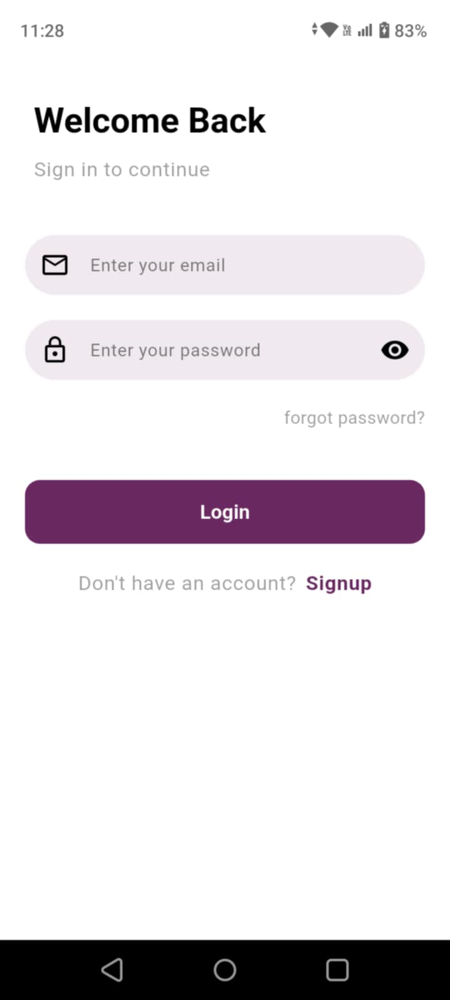
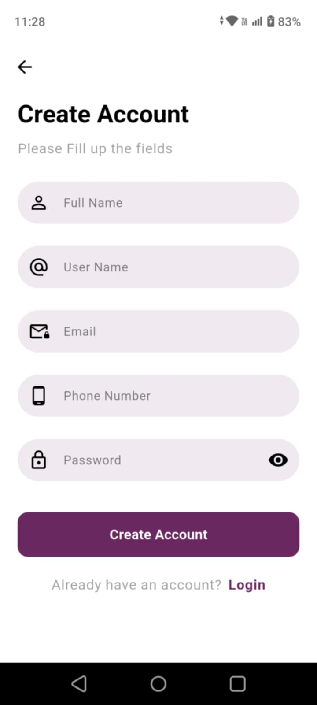
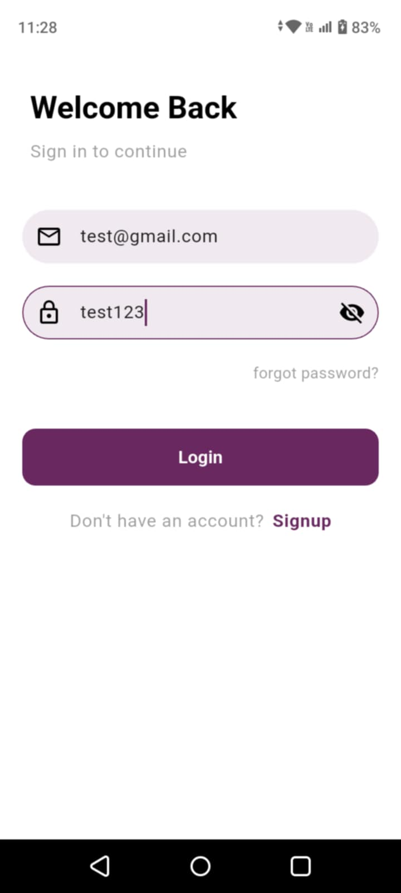
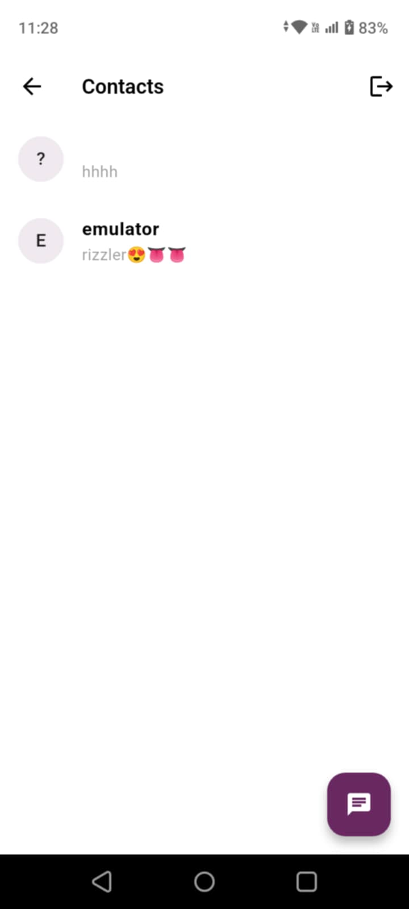
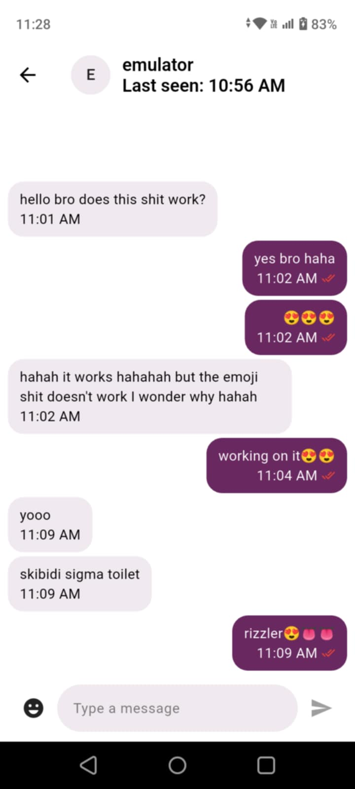
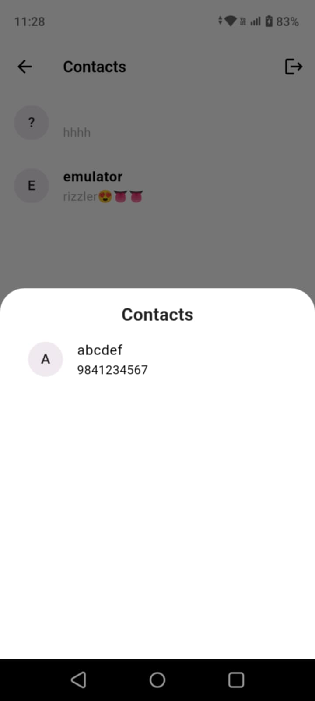
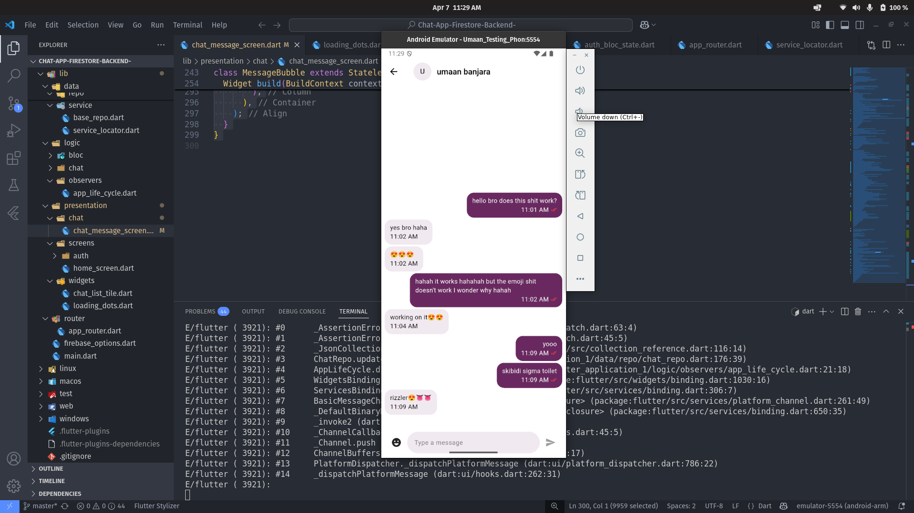
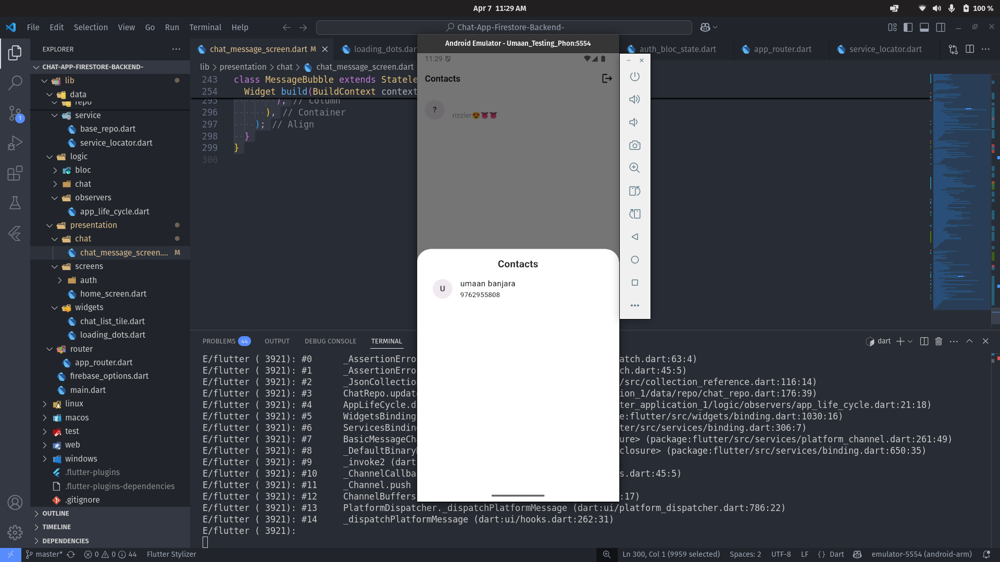

# 💬 Flutter Chat App with Firebase

A feature-rich chat application built using **Flutter**, **Firebase Auth**, **Firestore**, and **Bloc/Cubit** architecture with **GetIt** dependency injection. The app provides a smooth and interactive messaging experience.

---

## 🚀 Features

- 🔐 Firebase Authentication (Email/Password & Phone Number Login)
- ☁️ Firestore as backend database
- 📦 Clean architecture with `get_it` for dependency injection
- 🧠 State Management using **Cubit** and **Bloc**
- ✨ Beautiful and minimal UI
- 🗂️ Well-structured folder management
- 🟢 Real-time **last seen** & **message sync**
- ✍️ Typing indicator animation
- 📱 Email/password login & phone number-based chatting

---

## 🛠️ Packages Used

| Package              | Purpose                                |
|----------------------|----------------------------------------|
| `flutter_bloc`       | Bloc/Cubit state management            |
| `firebase_core`      | Initialize Firebase                    |
| `firebase_auth`      | User authentication                    |
| `cloud_firestore`    | Cloud Firestore database               |
| `get_it`             | Dependency injection                   |
| `equatable`          | Simplify equality in Dart models       |
| `intl`               | Date and time formatting               |
| `emoji_picker_flutter` | Emoji picker integration             |

---

## 📸 Screenshots

Here are some of the screens from the app:

### 🔐 Login Screen


### 🆕 Signup Screen


### 🔍 Login with Details


### 💬 Chat Screen


### 📱 Chat Message Screen


### 🧑 Contacts Screen


### 📱 Emulator - Chat Screen


### 📞 Emulator - Contact Screen


---

## 🏁 Getting Started

### 🔧 Prerequisites
Make sure you have Flutter installed:
```bash
flutter doctor
```

### 📦 Install Dependencies
```bash
flutter pub get
```

### 📲 Run on Emulator or Device
To launch an emulator:
```bash
flutter emulators
flutter emulators --launch <emulator-id>
```

To run on device:
```bash
flutter run
```

> ⚠️ Make sure to set up `google-services.json` for Android and Firebase project correctly.

---

## 🧠 Folder Structure

```bash
lib/
├── config/              # App theme and configs
├── core/                # Common widgets and utils
├── data/
│   ├── models/          # Data models (User, Message, etc)
│   ├── repo/            # Repositories
│   └── service/         # Service locator & base repo
├── logic/
│   ├── bloc/            # Auth Bloc files
│   ├── chat/            # Chat Cubit files
│   └── observers/       # App life cycle
├── presentation/
│   ├── chat/            # Chat UI
│   ├── screens/         # Auth, Home, etc
│   └── widgets/         # Reusable UI widgets
├── router/              # App routing
└── main.dart            # Entry point
```

---

## 👤 Author

- 💌 Email: [umaanbanjara@gmail.com](mailto:umaanbanjara@gmail.com)

---

## ⭐ Give it a star
If you found this helpful, feel free to star the repo 🌟

---

Feel free to suggest improvements or report issues. Happy Coding! 💙

